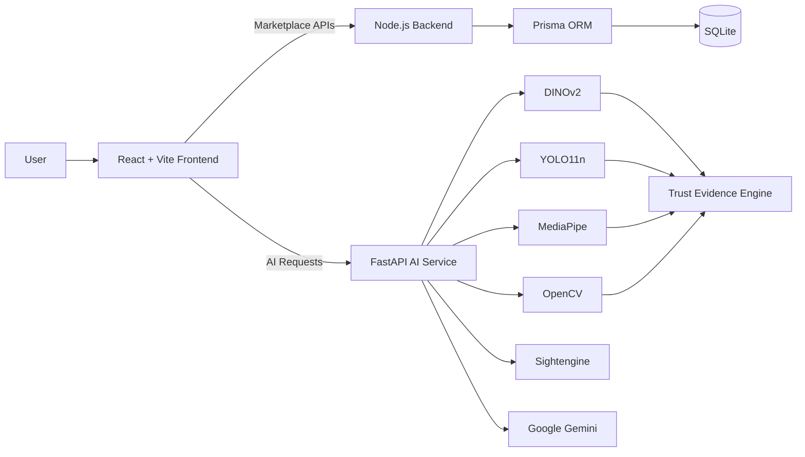
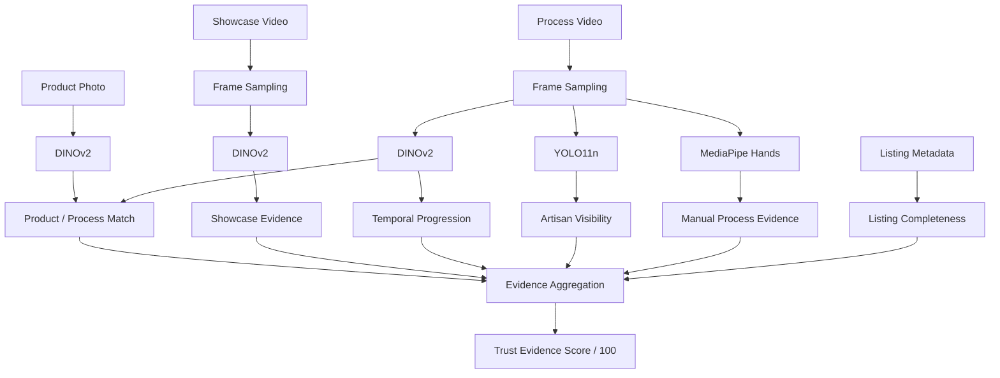

# KARIGAR — Stories You Can Hold

KARIGAR is a full-stack artisan marketplace focused on **craft storytelling, transparent product evidence, and easier digital onboarding for artisans**.

The platform combines a buyer/seller marketplace with a separate AI verification service that analyses product photos, showcase videos, craft-process footage, artisan visibility, hand activity, and listing completeness to generate a **KARIGAR Trust Evidence Score**.

> **Important:** the Trust Evidence Score measures the strength of supporting evidence submitted with a listing. It is **not an authenticity probability or guarantee**.

---

## What problem does KARIGAR solve?

Traditional artisans often face three major problems online:

- limited digital reach,
- difficulty creating professional product listings,
- and lack of trust/context around handmade products.

A normal marketplace may show only:

```text
Product → Price → Buy
```

KARIGAR aims to show:

```text
Product
  ↓
Artisan
  ↓
Craft / Region
  ↓
Product Media
  ↓
Making Process
  ↓
Trust Evidence
  ↓
Purchase
```

This helps customers understand the story and process behind a product while giving artisans a stronger digital identity.

---

# Core Features

## For Artisans

- Artisan registration and authentication
- Seller dashboard
- Guided Add Product workflow
- Product photo upload
- Optional showcase-video upload
- Making-process video upload
- Live process-video capture
- Voice-assisted product-detail generation
- Media-authenticity screening
- AI-based craft evidence analysis
- Review-before-publish workflow
- Product inventory and stock management
- Persistent product publishing

## For Buyers

- Browse artisan products
- Explore products by collection/artisan
- View product details and media
- View stock availability
- View KARIGAR Trust Evidence Score
- Add products to cart
- Checkout through the prototype order flow
- Discover the artisan and process behind a product

## Trust & AI Features

- DINOv2 visual embeddings
- Product ↔ process similarity
- YOLO11n person detection
- MediaPipe hand detection
- Video temporal-progression analysis
- Product-video consistency analysis
- Listing-completeness scoring
- Sightengine media-authenticity screening
- Live-capture provenance
- Gemini-powered voice onboarding

---

# System Architecture



KARIGAR currently has **two backend layers**:

1. **Node.js backend** — marketplace, authentication, products, orders, uploads and database operations.
2. **Python FastAPI service** — AI verification, media analysis, voice onboarding and related AI features.

---

# Tech Stack

## Frontend

| Technology | Purpose |
|---|---|
| React 19 | Frontend application |
| Vite 8 | Development server and build tool |
| Tailwind CSS 4 | Styling |
| React Router DOM | Client-side routing |
| GSAP | Animations |
| Lucide React | Icons |
| i18next / react-i18next | Internationalization |

## Backend

| Technology | Purpose |
|---|---|
| Node.js | Main marketplace backend |
| Native Node HTTP | API/server implementation |
| JWT | Authentication |
| bcryptjs | Password hashing |
| Prisma | ORM and migrations |
| SQLite | Current prototype database |

## AI / Computer Vision

| Technology | Purpose |
|---|---|
| Python | AI runtime |
| FastAPI | AI service |
| Uvicorn | FastAPI server |
| PyTorch | Deep-learning inference |
| Transformers | DINOv2 loading |
| DINOv2 Small | Visual embeddings |
| YOLO11n | Person/object detection |
| MediaPipe | Hand evidence |
| OpenCV | Video/frame processing |
| Pillow | Image handling |
| Sightengine | Media-authenticity screening |
| Google Gemini | Voice-assisted listing |

---

# KARIGAR Trust Evidence Engine

The Trust Evidence Score is **not generated by one model**.

It combines multiple signals from the seller's submitted evidence.



---

## Score Breakdown

| Evidence Category | Maximum |
|---|---:|
| Product Photo Evidence | 35 |
| Product Showcase Video | 15 |
| Craft Process Evidence | 20 |
| Artisan Visibility | 15 |
| Product ↔ Process Match | 10 |
| Listing Completeness | 5 |
| **Total** | **100** |

The final score is a weighted evidence score, not a statement such as:

```text
"82% authentic"
```

Instead, it should be interpreted as:

```text
"82 / 100 supporting evidence strength"
```

---

# How the AI Pipeline Works

## 1. Product Photo

The primary product image is validated and passed through:

```text
facebook/dinov2-small
```

DINOv2 converts the image into a visual embedding.

The model is used as a **feature extractor**, not as an authenticity classifier.

---

## 2. Video Frame Sampling

KARIGAR samples representative frames from uploaded videos instead of analysing every frame.

```text
Video
 ↓
Sample Frames
 ↓
AI Models
```

This reduces inference time and GPU/CPU cost.

---

## 3. Product ↔ Process Match

The product image embedding is compared against embeddings from process-video frames using cosine similarity.

Conceptually:

```text
Product Image
     ↓
DINOv2
     ↓
Embedding
     ↕
Process Frame Embeddings
```

This checks whether the process footage is visually related to the listed product.

It does **not** prove authenticity.

---

## 4. Artisan Visibility

YOLO11n checks sampled process-video frames for person presence.

This contributes to the Artisan Visibility category.

KARIGAR does **not** use this for:

- face recognition,
- identity verification,
- age detection,
- gender detection,
- emotion recognition.

---

## 5. Hand / Manual Process Evidence

MediaPipe checks sampled process frames for visible hands.

This is useful because many genuine craft videos primarily show:

```text
Hands + Tools + Material + Product
```

rather than the artisan's full body.

Hand presence therefore contributes to Craft Process Evidence.

---

## 6. Temporal Progression

The system compares neighbouring sampled video-frame embeddings.

This helps identify whether meaningful visual progression occurs through the process footage.

Examples include:

```text
Raw material
   ↓
Shaping
   ↓
Decoration
   ↓
Finished product
```

The metric is treated only as supporting evidence because camera movement and lighting changes can also affect frame similarity.

---

## 7. Listing Completeness

Listing completeness is rule-based rather than AI-generated.

It checks whether useful fields such as these were supplied:

- title,
- description,
- category,
- materials,
- price,
- region,
- dimensions,
- craft technique,
- artisan story.

Maximum contribution:

```text
5 / 5
```

---

# Media Authenticity Check

KARIGAR has a separate media-authenticity stage using **Sightengine**.

Its purpose is to estimate whether uploaded media appears:

- camera captured,
- AI generated / synthetic,
- or inconclusive.

This is kept separate from the Trust Evidence Score.

```text
Media Authenticity
        ≠
Craft Authenticity
```

A camera-like image does not automatically prove that a product is handmade.

---

# Live Capture

The AI service also contains live-capture functionality for process evidence.

A capture session can provide provenance showing that submitted media passed through the KARIGAR capture flow.

This is useful supporting evidence, but it is **not physical-camera attestation** and does not guarantee that the scene itself was genuine.

---

# Voice-Assisted Product Listing

Artisans can optionally describe their product through voice.

The FastAPI service uses **Google Gemini** for the voice-assisted product-detail workflow.

Conceptually:

```text
Artisan speaks
      ↓
Recorded audio
      ↓
AI processing
      ↓
Structured product details
      ↓
Product form
```

Manual product entry remains available if the AI service is unavailable.

---

# Product Publishing Flow

```text
1. Media & Craft Evidence
          ↓
2. Media Authenticity Check
          ↓
3. Product Details
          ↓
4. KARIGAR Evidence Analysis
          ↓
5. Review & Publish
```

Publishing sends the listing, media references and evidence snapshot to the Node backend.

The backend validates:

- authenticated artisan,
- listing fields,
- price,
- stock,
- uploaded media,
- evidence-score bounds,
- request ownership.

Product media is stored under:

```text
public/uploads/products
```

and the database stores the generated file paths.

---

# Database

Current database:

```text
SQLite
```

ORM:

```text
Prisma
```

The schema currently includes the main marketplace models:

```text
User
Product
Order
OrderItem
EscrowPayment
```

## User

Stores data such as:

- name,
- email,
- mobile,
- password hash,
- role,
- craft type,
- location,
- experience,
- business name,
- GI tag,
- cluster,
- verification state.

Supported role values include:

```text
ARTISAN
PATRON
ADMIN
```

## Product

Stores:

```text
artisanId
title
category
price
stock
detailsJson
mediaJson
evidenceJson
publishKey
```

This allows marketplace data, rich product details, media and evidence results to be persisted.

## Orders

An order stores:

- buyer,
- total amount,
- payment method,
- status,
- shipping address,
- order items.

Each order item references the actual Product record.

---

# Payment / Escrow Prototype

The repository contains an escrow-style order model with states such as:

```text
PAYMENT_PENDING
ESCROW_HELD
PROCESSING
SHIPPED
DELIVERED
DISPUTED
RELEASED
REFUNDED
```

The EscrowPayment model contains states such as:

```text
PENDING
HELD
RELEASED
DISPUTED
REFUNDED
```

However, the current implementation should be treated as a **prototype payment workflow** rather than a regulated real-money escrow system.

A production deployment should integrate a real payment provider for:

- UPI/card charging,
- settlements,
- refunds,
- disputes,
- artisan payouts.

---

# Project Structure

```text
KARIGAR/
│
├── ai-service/
│   ├── app/
│   │   ├── main.py
│   │   ├── routes/
│   │   └── services/
│   ├── tests/
│   └── requirements.txt
│
├── prisma/
│   ├── migrations/
│   ├── schema.prisma
│   └── seed.js
│
├── public/
│   └── uploads/
│
├── scripts/
├── server/
├── src/
│   ├── components/
│   ├── context/
│   ├── hooks/
│   ├── pages/
│   └── utils/
│
├── .env.example
├── package.json
├── vite.config.js
└── README.md
```

---

# Local Setup

## 1. Clone

```bash
git clone https://github.com/ayankrmondal2003-rgb/KARIGAR.git
cd KARIGAR
```

## 2. Install frontend/backend dependencies

```bash
npm install
```

## 3. Create `.env`

Windows PowerShell:

```powershell
Copy-Item .env.example .env
```

Configure the required credentials.

Example:

```env
DATABASE_URL="file:./dev.db"
JWT_SECRET="your-secret"

VITE_GOOGLE_CLIENT_ID=""
GOOGLE_CLIENT_ID=""
GOOGLE_CLIENT_SECRET=""

PORT=5000

SIGHTENGINE_API_USER=""
SIGHTENGINE_API_SECRET=""
SIGHTENGINE_DETECTOR_VERSION="hosted-2026-09"

GEMINI_API_KEY=""
```

Never commit real secrets.

---

# Database Setup

Generate Prisma Client:

```bash
npx prisma generate
```

Apply migrations:

```bash
npx prisma migrate deploy
```

Seed demo data when required:

```bash
npm run seed:artisans
```

---

# AI Service Setup

Recommended development environment:

```text
Python 3.11
```

Create a virtual environment:

```bash
python -m venv .venv
```

Windows:

```powershell
.\.venv\Scripts\Activate.ps1
```

Install dependencies:

```bash
pip install -r ai-service/requirements.txt
```

Run FastAPI from `ai-service`:

```powershell
..\.venv\Scripts\python.exe -B -m uvicorn app.main:app --host 127.0.0.1 --port 8000 --reload
```

AI API:

```text
http://127.0.0.1:8000
```

Swagger:

```text
http://127.0.0.1:8000/docs
```

---

# Run the Web Application

Frontend:

```bash
npm run dev
```

Typical local URL:

```text
http://127.0.0.1:5173
```

Standalone Node server:

```bash
npm start
```

Default backend port:

```text
5000
```

The project also contains:

```bash
npm run dev:ai
```

for starting the AI service through the repository helper script.

---

# Build and Lint

Production frontend build:

```bash
npm run build
```

Lint:

```bash
npm run lint
```

KARIGAR currently uses **Oxlint**.

---

# Important Environment / Repository Rules

Do not commit:

```text
.env
API keys
OAuth secrets
.venv
Prisma development database files
runtime upload caches
```

Keep `.env.example` as the safe configuration template.

---

# Current Prototype Limitations

KARIGAR is a working prototype, but some systems would need production upgrades.

### Database
Current:

```text
SQLite
```

Production direction:

```text
Managed PostgreSQL
```

### Media storage
Current:

```text
Local public/uploads
```

Production direction:

```text
Object storage + CDN
```

### AI processing
Current AI analysis is synchronous.

At large scale it should become:

```text
Upload
  ↓
Job Queue
  ↓
AI Worker Pool
  ↓
Stored Evidence Result
```

### Payments
The current escrow workflow is a prototype and does not represent a regulated live escrow provider.

---

# Trust Boundaries

KARIGAR can show that:

- evidence was submitted,
- media was analysed,
- hands/persons were detected,
- visual similarity was measured,
- process footage changed over time,
- listing fields were supplied.

KARIGAR does **not automatically prove**:

- that a product is legally or culturally authentic,
- that every seller claim is true,
- that the visible person is the registered artisan,
- that a process video was not staged,
- that AI-generated-media detection is perfectly accurate.

For this reason, the Trust Evidence Score should always remain an **evidence/transparency score**.

---

# Future Scope

Possible production improvements include:

- managed PostgreSQL,
- cloud object storage,
- CDN media delivery,
- real payment integration,
- background AI processing,
- scalable GPU workers,
- stronger seller reputation signals,
- verified-purchase history,
- craft-cluster / cooperative verification,
- expanded multilingual onboarding,
- artisan-focused mobile experience,
- craft-specific AI models built from consented datasets.

---

# Why KARIGAR?

A conventional marketplace helps users buy a product.

KARIGAR aims to help users understand:

```text
Who made it?
Where did it come from?
How was it made?
What evidence supports the listing?
```

At the same time, artisans gain an opportunity to compete through **craftsmanship, transparency and story — not only price**.

---

## KARIGAR
### Stories You Can Hold
Made by TEAM 4 LOOPS
